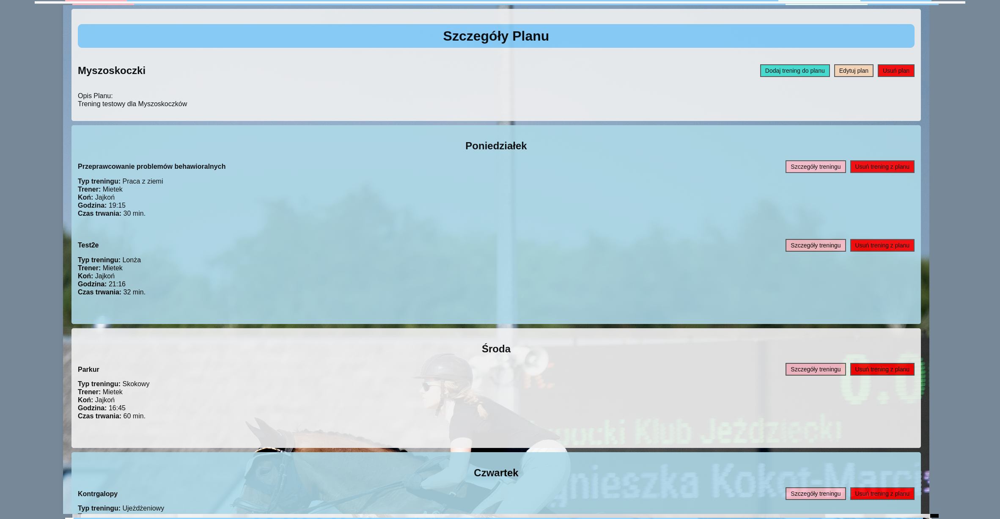

<h1 align="center"> Welcome to <strong>Patataj</strong>, a webapp for making custom training plans</h1>

## Description:

This app was made for my project during python programming course at [CodersLab](https://github.com/CodersLab). It was developed after approximately 2 months of learning.
The idea behind the app was to help my wife and her equestrian friends to manage training plans and save some events in calendar. Please note that the app is in Polish.

## Technologies:

- **Framework**: Django
- **Backend**: Python
- **Frontend**: HTML, CSS and some JavaScript
- **Database**: PostgreSQL
- **Other**: Font Awesome, FullCalendar, pytest/pytest-django

### Setup:
It's straightforward:
1. Clone repository.
2. Install dependencies from requirements.txt
3. Make migrations and run the dev server.

### Usage:
1. **Homepage**: Overview of the application with featured sections.
2. **Trainings**: Browse and filter through available trainings or add some new ones.
3. **Plans**: Create and manage custom training plans.
4. **Horses**: Manage your horses.
5. **Trainers**: Find and add new trainers.
6. **Calendar**: Schedule and view your training sessions.

Please have in mind that the content of the app is made in Polish language. All the comments to the code and descriptions are made in English.

### License:
You are free to use, modify, and distribute this application for your private, personal use.

### Tests:
I have made a total of 104 tests (for 32 views):

For more details about the tests go to the tests.py file in each of the apps (patataj, accounts, kalendarz).

### Visualization:
1. **Homepage:**

2. **Trainings:**

3. **Plan Details:**

4. **Add Horse:**

## Author:
- **email**: mateusz.marciszm@gmail.com
- **github**: [MateuszMarcisz](https://github.com/MateuszMarcisz)
- **CodeWars**: [T0dl3r](https://www.codewars.com/users/T0dl3r)
- **GS**: [GoogleScholar](https://scholar.google.com/citations?user=QW3tlewAAAAJ&hl=en)

